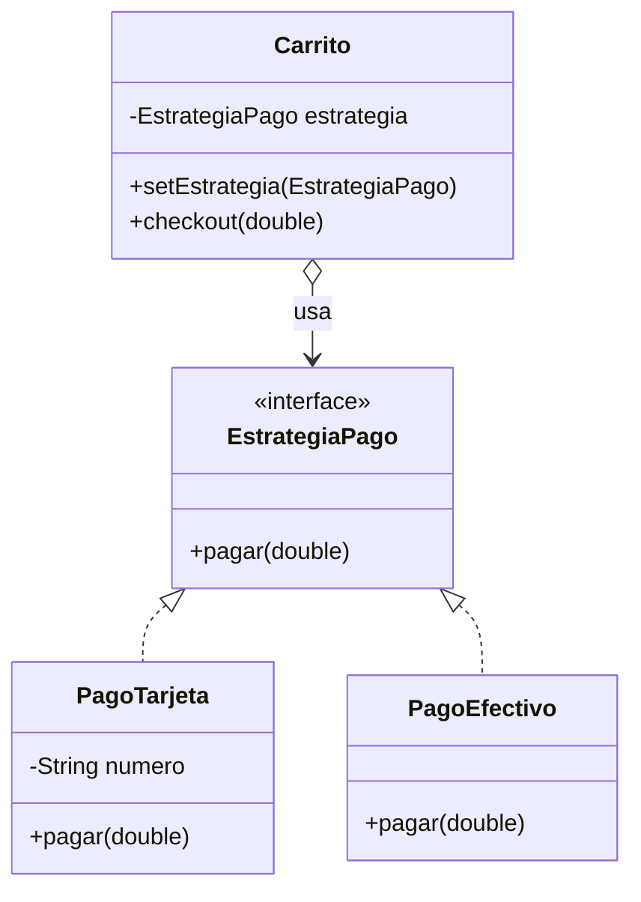
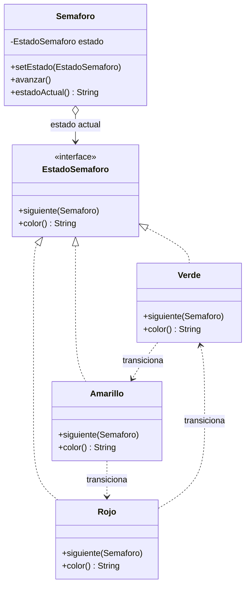
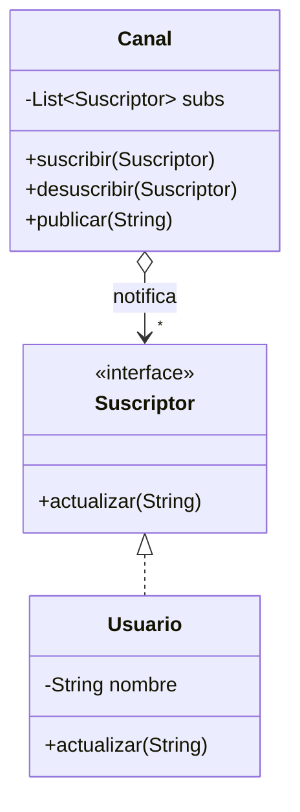
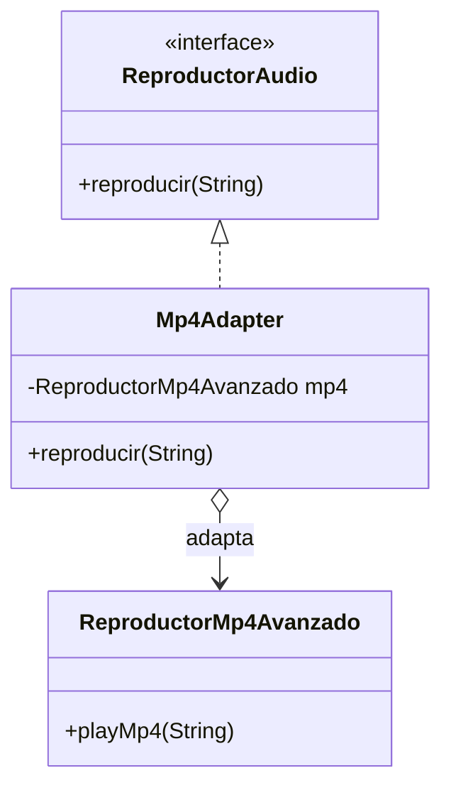
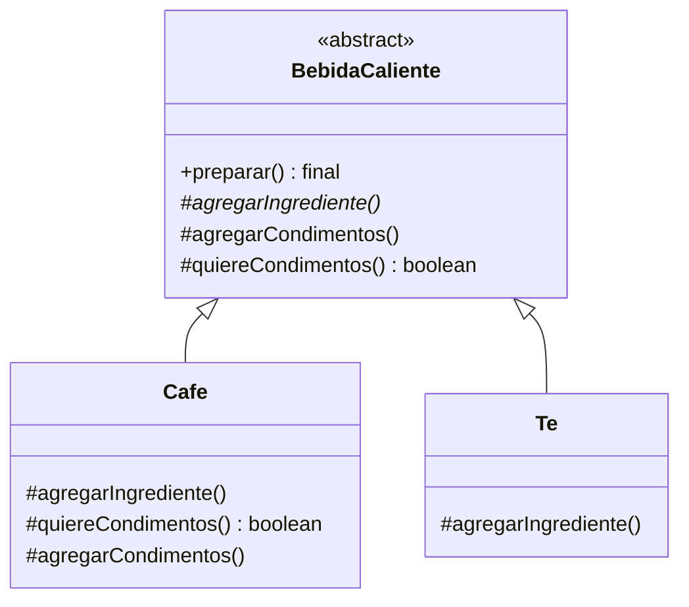
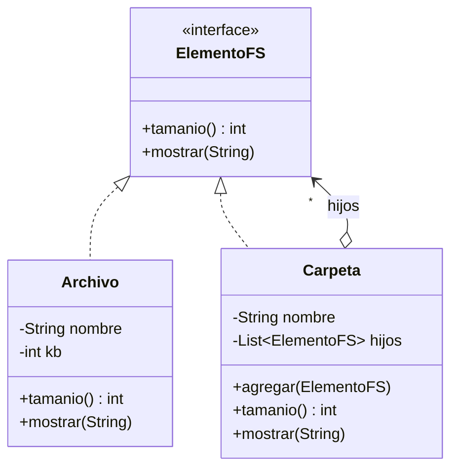
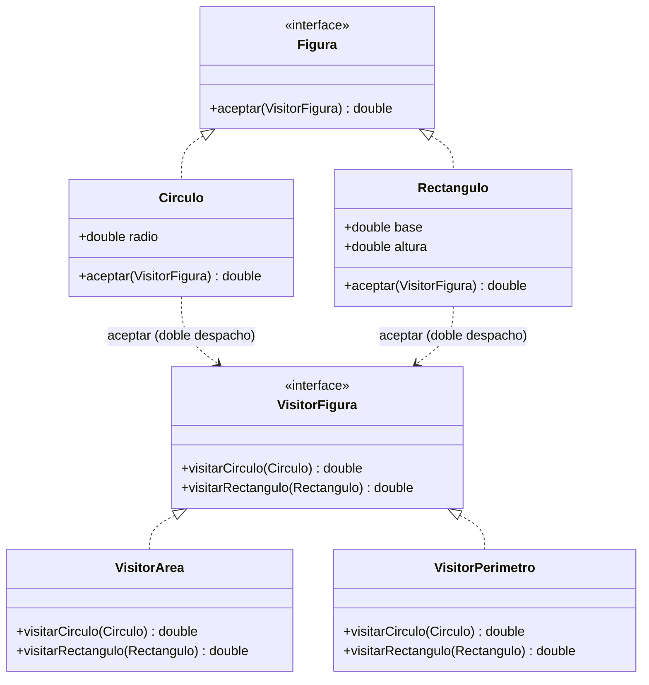
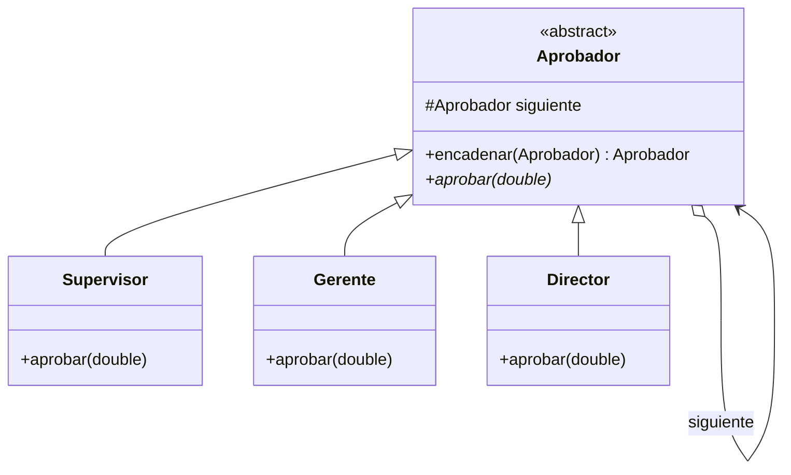

# Guía de Patrones de Diseño (GoF) — POO en Java

> Material de estudio para TPs y parciales. Lenguaje: **Java** (Eclipse).
> Patrones cubiertos: **Strategy, State, Observer, Adapter, Template Method, Composite, Visitor, Chain of Responsibility**.

## Clasificación rápida (esto suele preguntarse)

| Patrón | Categoría | Problema que resuelve en una frase |
|---|---|---|
| Strategy | Comportamiento | Intercambiar algoritmos en tiempo de ejecución |
| State | Comportamiento | Cambiar el comportamiento de un objeto según su estado interno |
| Observer | Comportamiento | Notificar automáticamente a muchos objetos cuando uno cambia |
| Template Method | Comportamiento | Fijar el esqueleto de un algoritmo y dejar pasos a las subclases |
| Visitor | Comportamiento | Agregar operaciones a una jerarquía sin tocar sus clases |
| Chain of Responsibility | Comportamiento | Pasar una petición por una cadena de manejadores |
| Adapter | Estructural | Hacer que dos interfaces incompatibles trabajen juntas |
| Composite | Estructural | Tratar igual a objetos individuales y a grupos de objetos |

**Tip de parcial:** te pueden dar un enunciado y pedir "qué patrón aplicarías y por qué". Memorizá la columna de la derecha: es la *intención* (intent) de cada patrón.

---

## Cómo leer los diagramas UML

Los diagramas están en **Mermaid** (UML de clases). Para verlos renderizados:
- **GitHub**: se ven directo.
- **VS Code**: instalá la extensión *"Markdown Preview Mermaid Support"* y abrí la vista previa (`Ctrl+Shift+V`).

**Notación de relaciones (las flechas que más caen en el parcial):**

| Símbolo | Relación | Significado |
|---|---|---|
| `<|..` | Realización | Una clase **implementa** una interfaz (`implements`) |
| `<|--` | Herencia | Una clase **extiende** otra (`extends`) |
| `o-->` | Agregación | "tiene un / usa un" — el objeto **guarda una referencia** a otro |
| `..>` | Dependencia | Lo **usa puntualmente** (lo recibe por parámetro, lo invoca) |

**Notación dentro de la clase:** `+` público · `-` privado · `#` protegido · `*` método abstracto · `<<interface>>` / `<<abstract>>` estereotipos.

---

# 1. STRATEGY (Estrategia)

### Cómo funciona
Define una **familia de algoritmos**, encapsula cada uno en su propia clase y los hace **intercambiables**. El objeto que los usa (el *Context*) no sabe qué algoritmo concreto está corriendo: solo conoce una interfaz común. Cambiás el comportamiento **inyectando** una estrategia distinta.

**Participantes:**
- `Strategy` (interfaz): declara el método común.
- `ConcreteStrategy`: cada algoritmo concreto.
- `Context`: tiene una referencia a una `Strategy` y delega en ella.

### Cuándo conviene usarlo
- Tenés **varias maneras de hacer lo mismo** (varios algoritmos) y querés elegir en runtime.
- Querés **eliminar `if/else` o `switch`** gigantes que eligen comportamiento.
- Distintas variantes de un algoritmo que difieren solo en una parte.

### Ventajas y desventajas
**Ventajas:**
- Reemplaza condicionales por polimorfismo.
- Se pueden agregar nuevas estrategias sin tocar el Context (Open/Closed).
- Se puede cambiar el algoritmo en tiempo de ejecución.

**Desventajas:**
- Más clases (una por estrategia).
- El cliente debe conocer las estrategias para elegir la correcta.

### Ejemplo del mundo real
Las formas de pago de un carrito: tarjeta, efectivo, Mercado Pago. El carrito no cambia; lo que cambia es *cómo se paga*.

### Diagrama UML


### Código Java
```java
// Strategy
public interface EstrategiaPago {
    void pagar(double monto);
}

// ConcreteStrategy A
public class PagoTarjeta implements EstrategiaPago {
    private String numero;
    public PagoTarjeta(String numero) { this.numero = numero; }
    public void pagar(double monto) {
        System.out.println("Pagó $" + monto + " con tarjeta " + numero);
    }
}

// ConcreteStrategy B
public class PagoEfectivo implements EstrategiaPago {
    public void pagar(double monto) {
        System.out.println("Pagó $" + monto + " en efectivo");
    }
}

// Context
public class Carrito {
    private EstrategiaPago estrategia;
    public void setEstrategia(EstrategiaPago e) { this.estrategia = e; }
    public void checkout(double total) {
        estrategia.pagar(total);   // delega, no sabe el "cómo"
    }
}

// Uso
public class Main {
    public static void main(String[] args) {
        Carrito c = new Carrito();
        c.setEstrategia(new PagoTarjeta("1234"));
        c.checkout(1500);
        c.setEstrategia(new PagoEfectivo());   // cambio en runtime
        c.checkout(800);
    }
}
```

### Paso a paso de la ejecución (repaso rápido)

El programa **siempre arranca en `main`**. Seguimos cada línea:

1. **`Carrito c = new Carrito();`** → se crea el carrito. Su atributo `estrategia` arranca en **`null`** (nadie le asignó nada todavía).

2. **`c.setEstrategia(new PagoTarjeta("1234"));`** → en dos sub-pasos:
   - Se crea un `PagoTarjeta` y su constructor guarda `numero = "1234"`.
   - Ese objeto se pasa al setter, que ejecuta `this.estrategia = e` → el carrito **guarda** esa estrategia.
   - 📦 Estado: `c.estrategia` → un `PagoTarjeta` con `numero="1234"`.

3. **`c.checkout(1500);`** → entra a `checkout`, que ejecuta `estrategia.pagar(1500)`.
   - 🎯 **Polimorfismo:** `estrategia` es de tipo `EstrategiaPago` (interfaz), pero el objeto real es `PagoTarjeta`, así que Java ejecuta el `pagar` de `PagoTarjeta`.
   - Imprime: `Pagó $1500.0 con tarjeta 1234`.

4. **`c.setEstrategia(new PagoEfectivo());`** → `this.estrategia = e` **reemplaza** la estrategia anterior por un `PagoEfectivo`.
   - ⏱️ Esto es el **cambio en tiempo de ejecución**: el mismo carrito ahora paga distinto, sin recompilar.

5. **`c.checkout(800);`** → ahora `estrategia.pagar(800)` ejecuta el `pagar` de `PagoEfectivo`.
   - Imprime: `Pagó $800.0 en efectivo`.

**Salida final:**
```
Pagó $1500.0 con tarjeta 1234
Pagó $800.0 en efectivo
```

**Las 3 ideas clave del trace:**
- El `Carrito` (Context) **delega**: nunca decide *cómo* se paga, se lo pide a `estrategia`. Por eso no tiene `if/else`.
- El **polimorfismo es el motor**: la misma línea `estrategia.pagar(total)` da resultados distintos según el objeto guardado (*dynamic dispatch*).
- `setEstrategia` permite el **cambio en caliente**: el mismo objeto `c` cambió de comportamiento entre el paso 3 y el 5. Eso la herencia no lo permite.

### ¿Por qué es necesaria la línea `this.estrategia = e;`?

Esa línea es la que **asigna y guarda** la estrategia en el carrito. No es lo que la "fija": es lo que la **cambia**.

- **Si la borrás:** el setter no hace nada, el atributo `estrategia` queda en **`null`**, y al llamar `checkout` → `estrategia.pagar(total)` revienta con `NullPointerException` (le pedís un método a la nada). NO queda "fija", queda **vacía**.

- **Para que la estrategia quede FIJA** (que no cambie nunca): se asigna en el **constructor**, con `final`, y **sin** método setter:
  ```java
  public class Carrito {
      private final EstrategiaPago estrategia;   // final = no se reasigna
      public Carrito(EstrategiaPago e) { this.estrategia = e; }  // se elige al crear
      // sin setEstrategia(...)  → no se puede cambiar después
      public void checkout(double total) { estrategia.pagar(total); }
  }
  ```

| | Con `setEstrategia(...)` (ejemplo) | Solo en constructor + `final` |
|---|---|---|
| ¿Se puede cambiar después? | ✅ Sí, llamando el setter otra vez | ❌ No, queda fija |
| Para qué sirve | Cambiar comportamiento en runtime | Garantizar que no cambie |

> 🔑 Resumen: `this.estrategia = e;` = "guardá esta estrategia". Lo que permite **cambiarla** es que esté dentro de un **setter** reutilizable; cada llamada **reemplaza** la anterior.

---

# 2. STATE (Estado)

### Cómo funciona
Permite que un objeto **altere su comportamiento cuando cambia su estado interno**. Parece que el objeto cambia de clase. Cada estado se modela como una clase con su propia lógica, y el objeto principal (*Context*) **delega** el trabajo en el objeto-estado actual. Las transiciones entre estados las hacen los propios estados (o el Context).

**Participantes:**
- `State` (interfaz): operaciones que dependen del estado.
- `ConcreteState`: implementa el comportamiento de ese estado y decide la transición al siguiente.
- `Context`: mantiene una referencia al estado actual y delega en él.

### Cuándo conviene usarlo
- El comportamiento de un objeto depende de su estado y **cambia en runtime**.
- Tenés muchos `if (estado == X)` repartidos por toda la clase.
- Modelás una **máquina de estados** (semáforo, pedido, cajero, puerta).

### Ventajas y desventajas
**Ventajas:**
- Elimina condicionales gigantes sobre el estado.
- Cada estado queda aislado y es fácil de mantener.
- Las transiciones son explícitas.

**Desventajas:**
- Muchas clases si hay muchos estados.
- Puede ser overkill si hay pocos estados simples.

### State vs Strategy (¡pregunta clásica de parcial!)
Estructuralmente son casi idénticos. La diferencia está en la **intención**:
- **Strategy:** el cliente elige el algoritmo; las estrategias **no se conocen entre sí**.
- **State:** el objeto cambia de estado **solo**, y los estados **conocen y disparan** las transiciones a otros estados.

### Ejemplo del mundo real
Un semáforo: en Verde, al avanzar pasa a Amarillo; en Amarillo pasa a Rojo; en Rojo pasa a Verde. Cada color "sabe" cuál sigue.

### Diagrama UML


### Código Java
```java
// State
public interface EstadoSemaforo {
    void siguiente(Semaforo s);
    String color();
}

// ConcreteState
public class Verde implements EstadoSemaforo {
    public void siguiente(Semaforo s) { s.setEstado(new Amarillo()); }
    public String color() { return "VERDE"; }
}
public class Amarillo implements EstadoSemaforo {
    public void siguiente(Semaforo s) { s.setEstado(new Rojo()); }
    public String color() { return "AMARILLO"; }
}
public class Rojo implements EstadoSemaforo {
    public void siguiente(Semaforo s) { s.setEstado(new Verde()); }
    public String color() { return "ROJO"; }
}

// Context
public class Semaforo {
    private EstadoSemaforo estado = new Rojo();
    public void setEstado(EstadoSemaforo e) { this.estado = e; }
    public void avanzar() { estado.siguiente(this); }
    public String estadoActual() { return estado.color(); }
}

// Uso
public class Main {
    public static void main(String[] args) {
        Semaforo s = new Semaforo();
        for (int i = 0; i < 4; i++) {
            System.out.println(s.estadoActual());
            s.avanzar();
        }
        // ROJO, VERDE, AMARILLO, ROJO
    }
}
```

---

# 3. OBSERVER (Observador)

### Cómo funciona
Define una relación **uno-a-muchos**: cuando un objeto (*Subject/Observable*) cambia de estado, **notifica automáticamente** a todos sus dependientes (*Observers*) y estos se actualizan solos. El Subject no sabe quiénes son los observers concretos, solo que cumplen una interfaz.

**Participantes:**
- `Subject` (Observable): mantiene la lista de observers; permite suscribir/desuscribir; notifica.
- `Observer` (interfaz): método `actualizar()` que invoca el Subject.
- `ConcreteObserver`: reacciona al cambio.

### Cuándo conviene usarlo
- Un cambio en un objeto debe **reflejarse en otros** sin acoplarlos fuertemente.
- Sistemas de **eventos / publicación-suscripción**.
- Patrón base de la arquitectura **MVC** (la Vista observa al Modelo).

### Ventajas y desventajas
**Ventajas:**
- Bajo acoplamiento entre Subject y Observers.
- Podés agregar/quitar observers en runtime.
- Soporta comunicación tipo broadcast.

**Desventajas:**
- El orden de notificación no está garantizado.
- Si no desuscribís, podés tener **fugas de memoria** (lapsed listener).
- Cascadas de actualizaciones difíciles de depurar.

### Ejemplo del mundo real
Un canal de YouTube (Subject) y sus suscriptores (Observers): cuando sube un video, todos reciben la notificación.

### Diagrama UML


### Código Java
```java
import java.util.ArrayList;
import java.util.List;

// Observer
public interface Suscriptor {
    void actualizar(String video);
}

// Subject
public class Canal {
    private List<Suscriptor> subs = new ArrayList<>();
    public void suscribir(Suscriptor s) { subs.add(s); }
    public void desuscribir(Suscriptor s) { subs.remove(s); }
    public void publicar(String video) {
        System.out.println("Canal subió: " + video);
        for (Suscriptor s : subs) s.actualizar(video);   // notifica a todos
    }
}

// ConcreteObserver
public class Usuario implements Suscriptor {
    private String nombre;
    public Usuario(String nombre) { this.nombre = nombre; }
    public void actualizar(String video) {
        System.out.println("  " + nombre + " recibió aviso de: " + video);
    }
}

// Uso
public class Main {
    public static void main(String[] args) {
        Canal canal = new Canal();
        Suscriptor ana = new Usuario("Ana");
        Suscriptor leo = new Usuario("Leo");
        canal.suscribir(ana);
        canal.suscribir(leo);
        canal.publicar("Patrones de Diseño");
        canal.desuscribir(leo);
        canal.publicar("POO en Java");
    }
}
```
> Nota: Java trae `java.util.Observer/Observable` pero están **deprecados** desde Java 9. Para el parcial implementá tu propia interfaz como arriba.

---

# 4. ADAPTER (Adaptador)

### Cómo funciona
Convierte la **interfaz de una clase en otra interfaz** que el cliente espera. Permite que colaboren clases con interfaces **incompatibles** (típico al integrar código viejo o una librería externa). El Adapter "envuelve" al objeto adaptado y traduce las llamadas.

**Participantes:**
- `Target` (interfaz): la que el cliente espera usar.
- `Adaptee`: la clase existente con interfaz incompatible.
- `Adapter`: implementa `Target` y por dentro delega en el `Adaptee` traduciendo.

Hay dos variantes: **por objeto** (composición, la más usada en Java) y **por clase** (herencia, requiere herencia múltiple → poco viable en Java).

### Cuándo conviene usarlo
- Querés usar una clase existente cuya interfaz **no coincide** con la que necesitás.
- Integrar **librerías de terceros** o **código legacy** sin modificarlos.
- Unificar interfaces de varias clases parecidas.

### Ventajas y desventajas
**Ventajas:**
- Reutilizás clases existentes sin tocar su código.
- Separa la conversión de interfaz de la lógica de negocio (SRP).

**Desventajas:**
- Agrega una capa de indirección (más clases).
- A veces es señal de un mal diseño previo de interfaces.

### Ejemplo del mundo real
El **adaptador de enchufe** del viajero: el aparato espera una toma, la pared ofrece otra, el adaptador traduce.

### Diagrama UML


### Código Java
```java
// Target: lo que el cliente espera
public interface ReproductorAudio {
    void reproducir(String archivo);
}

// Adaptee: clase existente con OTRA interfaz
public class ReproductorMp4Avanzado {
    public void playMp4(String nombre) {
        System.out.println("Reproduciendo MP4: " + nombre);
    }
}

// Adapter
public class Mp4Adapter implements ReproductorAudio {
    private ReproductorMp4Avanzado mp4 = new ReproductorMp4Avanzado();
    public void reproducir(String archivo) {
        mp4.playMp4(archivo);   // traduce la llamada
    }
}

// Uso
public class Main {
    public static void main(String[] args) {
        ReproductorAudio r = new Mp4Adapter();
        r.reproducir("clase_objetos.mp4");
    }
}
```

---

# 5. TEMPLATE METHOD (Método Plantilla)

### Cómo funciona
Define el **esqueleto de un algoritmo** en un método de la clase base (el *template method*) y deja que las **subclases redefinan pasos concretos** sin cambiar la estructura general del algoritmo. Usa **herencia**: el método plantilla suele ser `final` para que no se rompa el orden; los pasos variables son métodos `abstract` (o "hooks").

**Participantes:**
- `AbstractClass`: define el `templateMethod()` (con la secuencia fija) y declara los pasos abstractos.
- `ConcreteClass`: implementa los pasos abstractos.

### Cuándo conviene usarlo
- Varios algoritmos comparten la **misma estructura** pero difieren en algunos pasos.
- Querés **evitar duplicar** el código común y centralizar el control del flujo.
- Querés permitir extensiones solo en puntos específicos (hooks).

### Ventajas y desventajas
**Ventajas:**
- Reutiliza el código común en la clase base (evita duplicación).
- El flujo queda controlado en un solo lugar.

**Desventajas:**
- Usa **herencia** → acoplamiento fuerte con la clase base.
- Las subclases quedan limitadas a la estructura impuesta.

### Template Method vs Strategy
- **Template Method:** variación por **herencia** (en compilación).
- **Strategy:** variación por **composición** (en runtime).

### Ejemplo del mundo real
Preparar una bebida caliente: hervir agua → verter en taza → agregar el ingrediente (café o té) → opcional condimentos. La estructura es igual; solo cambia el ingrediente.

### Diagrama UML


### Código Java
```java
// AbstractClass
public abstract class BebidaCaliente {
    // Template Method: define el algoritmo y NO se puede sobreescribir
    public final void preparar() {
        hervirAgua();
        verterEnTaza();
        agregarIngrediente();   // paso variable
        if (quiereCondimentos()) // hook
            agregarCondimentos();
    }
    private void hervirAgua()   { System.out.println("Hirviendo agua"); }
    private void verterEnTaza() { System.out.println("Vertiendo en taza"); }

    protected abstract void agregarIngrediente();   // lo definen las subclases
    protected void agregarCondimentos() { }
    protected boolean quiereCondimentos() { return false; } // hook con default
}

// ConcreteClass
public class Cafe extends BebidaCaliente {
    protected void agregarIngrediente() { System.out.println("Agregando café"); }
    protected boolean quiereCondimentos() { return true; }
    protected void agregarCondimentos() { System.out.println("Agregando azúcar"); }
}
public class Te extends BebidaCaliente {
    protected void agregarIngrediente() { System.out.println("Agregando té"); }
}

// Uso
public class Main {
    public static void main(String[] args) {
        new Cafe().preparar();
        System.out.println("---");
        new Te().preparar();
    }
}
```

---

# 6. COMPOSITE (Compuesto)

### Cómo funciona
Compone objetos en **estructuras de árbol** para representar jerarquías **parte-todo**. Permite que el cliente trate de forma **uniforme** a objetos individuales (*hojas*) y a composiciones de objetos (*nodos*). Todos comparten una misma interfaz (*Component*).

**Participantes:**
- `Component` (interfaz/clase abstracta): operación común a hojas y compuestos.
- `Leaf` (hoja): elemento sin hijos.
- `Composite` (compuesto): contiene hijos (Components) y delega en ellos.

### Cuándo conviene usarlo
- Necesitás representar **jerarquías parte-todo** (árboles).
- Querés que el cliente **ignore la diferencia** entre un objeto y un grupo.
- Ejemplos: sistema de archivos (archivos/carpetas), menús/submenús, organigramas, componentes gráficos.

### Ventajas y desventajas
**Ventajas:**
- El cliente trata todo de manera uniforme (simplifica el código cliente).
- Fácil agregar nuevos tipos de Component.
- Estructura recursiva natural.

**Desventajas:**
- Puede ser **demasiado general**: difícil restringir qué tipos pueden ir juntos.
- Métodos como `agregar/quitar` no tienen sentido en las hojas (problema de transparencia vs seguridad).

### Ejemplo del mundo real
Un **sistema de archivos**: una carpeta contiene archivos y otras carpetas; calcular el tamaño total funciona igual para un archivo que para una carpeta (que suma a sus hijos).

### Diagrama UML


### Código Java
```java
import java.util.ArrayList;
import java.util.List;

// Component
public interface ElementoFS {
    int tamanio();
    void mostrar(String sangria);
}

// Leaf
public class Archivo implements ElementoFS {
    private String nombre; private int kb;
    public Archivo(String nombre, int kb) { this.nombre = nombre; this.kb = kb; }
    public int tamanio() { return kb; }
    public void mostrar(String s) { System.out.println(s + "- " + nombre + " (" + kb + "kb)"); }
}

// Composite
public class Carpeta implements ElementoFS {
    private String nombre;
    private List<ElementoFS> hijos = new ArrayList<>();
    public Carpeta(String nombre) { this.nombre = nombre; }
    public void agregar(ElementoFS e) { hijos.add(e); }
    public int tamanio() {
        int total = 0;
        for (ElementoFS e : hijos) total += e.tamanio();  // recursivo
        return total;
    }
    public void mostrar(String s) {
        System.out.println(s + "+ " + nombre + " (" + tamanio() + "kb)");
        for (ElementoFS e : hijos) e.mostrar(s + "   ");
    }
}

// Uso
public class Main {
    public static void main(String[] args) {
        Carpeta raiz = new Carpeta("TP_Objetos");
        raiz.agregar(new Archivo("Main.java", 5));
        Carpeta src = new Carpeta("src");
        src.agregar(new Archivo("Strategy.java", 8));
        src.agregar(new Archivo("Observer.java", 12));
        raiz.agregar(src);
        raiz.mostrar("");
        System.out.println("Total: " + raiz.tamanio() + "kb");
    }
}
```

---

# 7. VISITOR (Visitante)

### Cómo funciona
Permite **agregar operaciones nuevas** a una jerarquía de objetos **sin modificar sus clases**. Separa el algoritmo de la estructura sobre la que opera. Cada elemento de la estructura acepta un *Visitor* (`accept(visitor)`) y le pasa el control: el visitor define qué hacer con cada tipo de elemento (`visitarX`). Usa la técnica de **doble despacho (double dispatch)**.

**Participantes:**
- `Visitor` (interfaz): un método `visitar(...)` por cada tipo de elemento.
- `ConcreteVisitor`: implementa una operación concreta para toda la jerarquía.
- `Element` (interfaz): declara `accept(Visitor)`.
- `ConcreteElement`: implementa `accept` llamando a `visitor.visitar(this)`.

### Cuándo conviene usarlo
- Tenés una **estructura estable** de clases y necesitás **agregar muchas operaciones distintas** sobre ella.
- Querés evitar "ensuciar" las clases con métodos que no son de su responsabilidad.
- Ejemplos: recorrer un AST de un compilador, exportar a varios formatos, calcular reportes.

### Ventajas y desventajas
**Ventajas:**
- Agregar una operación nueva = agregar un visitor (no tocás la jerarquía → Open/Closed para operaciones).
- Junta operaciones relacionadas en una sola clase.

**Desventajas:**
- **Agregar un nuevo tipo de elemento es costoso**: hay que tocar todos los visitors. (Es el trade-off inverso al de la herencia normal).
- Rompe el encapsulamiento si el visitor necesita acceder al interior de los elementos.

### Ejemplo del mundo real
Un inspector que recorre distintas figuras (círculo, cuadrado) y calcula área; otro inspector recorre las mismas figuras y calcula perímetro. Las figuras no cambian; cambian los "visitantes".

### Diagrama UML


### Código Java
```java
// Visitor
public interface VisitorFigura {
    double visitarCirculo(Circulo c);
    double visitarRectangulo(Rectangulo r);
}

// Element
public interface Figura {
    double aceptar(VisitorFigura v);
}

// ConcreteElements
public class Circulo implements Figura {
    public double radio;
    public Circulo(double r) { this.radio = r; }
    public double aceptar(VisitorFigura v) { return v.visitarCirculo(this); }
}
public class Rectangulo implements Figura {
    public double base, altura;
    public Rectangulo(double b, double h) { this.base = b; this.altura = h; }
    public double aceptar(VisitorFigura v) { return v.visitarRectangulo(this); }
}

// ConcreteVisitor 1
public class VisitorArea implements VisitorFigura {
    public double visitarCirculo(Circulo c) { return Math.PI * c.radio * c.radio; }
    public double visitarRectangulo(Rectangulo r) { return r.base * r.altura; }
}
// ConcreteVisitor 2 (operación nueva SIN tocar las figuras)
public class VisitorPerimetro implements VisitorFigura {
    public double visitarCirculo(Circulo c) { return 2 * Math.PI * c.radio; }
    public double visitarRectangulo(Rectangulo r) { return 2 * (r.base + r.altura); }
}

// Uso
public class Main {
    public static void main(String[] args) {
        Figura[] figuras = { new Circulo(3), new Rectangulo(4, 5) };
        VisitorFigura area = new VisitorArea();
        VisitorFigura per  = new VisitorPerimetro();
        for (Figura f : figuras) {
            System.out.printf("Área=%.2f  Perímetro=%.2f%n", f.aceptar(area), f.aceptar(per));
        }
    }
}
```

---

# 8. CHAIN OF RESPONSIBILITY (Cadena de Responsabilidad)

### Cómo funciona
Evita acoplar el emisor de una petición a su receptor dando a **más de un objeto la oportunidad de manejarla**. Los manejadores se encadenan: cada uno decide si **procesa** la petición o la **pasa al siguiente** de la cadena. El emisor no sabe quién la va a resolver.

**Participantes:**
- `Handler` (interfaz/abstracta): define `manejar(peticion)` y referencia al `siguiente`.
- `ConcreteHandler`: procesa lo que le corresponde o delega al siguiente.

### Cuándo conviene usarlo
- Más de un objeto puede manejar una petición y **no sabés cuál de antemano**.
- Querés emitir una petición sin especificar el receptor explícitamente.
- Ejemplos: niveles de aprobación de gastos, validaciones en cadena, manejo de eventos, filtros de un servidor (middlewares), niveles de logging, soporte técnico escalonado.

### Ventajas y desventajas
**Ventajas:**
- Desacopla emisor y receptor.
- Flexibilidad: cambiás la cadena en runtime (orden, agregar/quitar manejadores).
- Cada manejador tiene una sola responsabilidad (SRP).

**Desventajas:**
- **No se garantiza** que la petición sea atendida (puede llegar al final sin manejarse).
- Puede ser difícil de depurar (¿quién la manejó?).

### Ejemplo del mundo real
**Aprobación de gastos:** el supervisor aprueba hasta $1.000; el gerente hasta $10.000; el director, montos mayores. Cada uno aprueba o pasa al de arriba.

### Diagrama UML


### Código Java
```java
// Handler
public abstract class Aprobador {
    protected Aprobador siguiente;
    public Aprobador encadenar(Aprobador sig) { this.siguiente = sig; return sig; }
    public abstract void aprobar(double monto);
}

// ConcreteHandlers
public class Supervisor extends Aprobador {
    public void aprobar(double monto) {
        if (monto <= 1000) System.out.println("Supervisor aprueba $" + monto);
        else if (siguiente != null) siguiente.aprobar(monto);
    }
}
public class Gerente extends Aprobador {
    public void aprobar(double monto) {
        if (monto <= 10000) System.out.println("Gerente aprueba $" + monto);
        else if (siguiente != null) siguiente.aprobar(monto);
    }
}
public class Director extends Aprobador {
    public void aprobar(double monto) {
        System.out.println("Director aprueba $" + monto);
    }
}

// Uso
public class Main {
    public static void main(String[] args) {
        Aprobador sup = new Supervisor();
        sup.encadenar(new Gerente()).encadenar(new Director());
        sup.aprobar(500);     // Supervisor
        sup.aprobar(7500);    // Gerente
        sup.aprobar(50000);   // Director
    }
}
```

---

# Cómo armar el proyecto en Eclipse

1. `File > New > Java Project` (ej. `PatronesObjetos`).
2. Dentro de `src`, creá un **package por patrón** (ej. `strategy`, `state`, `observer`, ...).
3. Cada clase de los ejemplos va en su **propio archivo `.java`** (mismo nombre que la clase pública). Agregá al inicio la línea `package nombrePaquete;`.
4. Cada `Main` se corre con `Run As > Java Application` (botón verde ▶).

> Las clases de arriba están escritas sin `package` para que las leas de corrido. Al pasarlas a Eclipse, agregá la línea `package ...;` y separá una clase por archivo.

---

# Resumen para repaso rápido (machete de parcial)

| Patrón | Mecanismo clave | Frase gatillo en el enunciado |
|---|---|---|
| Strategy | Composición + interfaz; intercambiar algoritmo | "distintas formas de calcular/hacer X" |
| State | Delega en objeto-estado; estados disparan transiciones | "el comportamiento depende del estado / máquina de estados" |
| Observer | Lista de suscriptores + notificar | "cuando cambia X, avisar a varios" |
| Adapter | Wrapper que traduce interfaz | "interfaces incompatibles / integrar librería existente" |
| Template Method | Método final + pasos abstractos (herencia) | "mismo procedimiento, pasos que varían" |
| Composite | Árbol; hoja y compuesto comparten interfaz | "parte-todo / jerarquía / tratar igual uno y muchos" |
| Visitor | Double dispatch; operación afuera de la jerarquía | "agregar operaciones sin tocar las clases" |
| Chain of Resp. | Cadena de handlers; pasar al siguiente | "varios pueden atender / niveles de aprobación" |

**Diferencias que más se preguntan:**
- **Strategy vs State:** misma estructura, distinta intención (cliente elige algoritmo vs el objeto cambia de estado solo).
- **Strategy vs Template Method:** composición/runtime vs herencia/compilación.
- **Adapter vs Decorator:** Adapter *cambia* la interfaz; Decorator la *mantiene* y agrega responsabilidades.
- **Visitor:** fácil agregar operaciones, difícil agregar tipos (trade-off inverso a la herencia normal).
