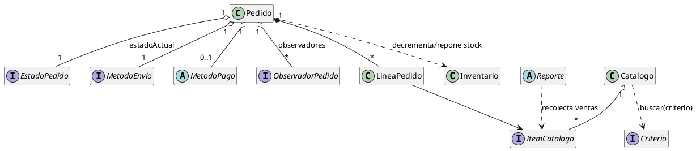
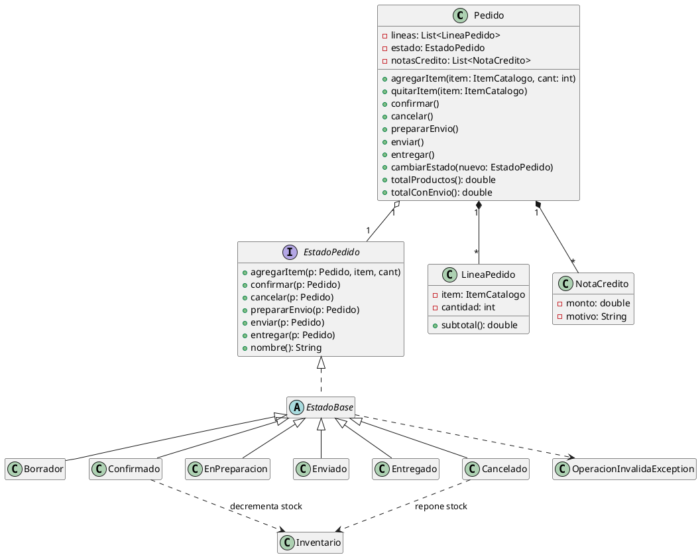
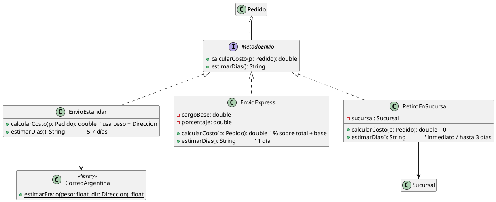
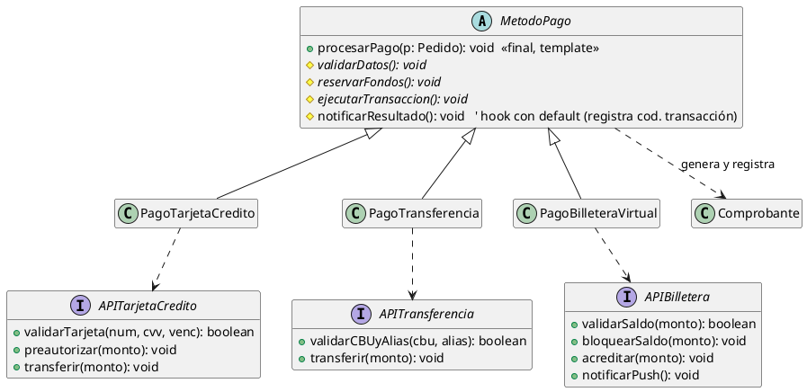
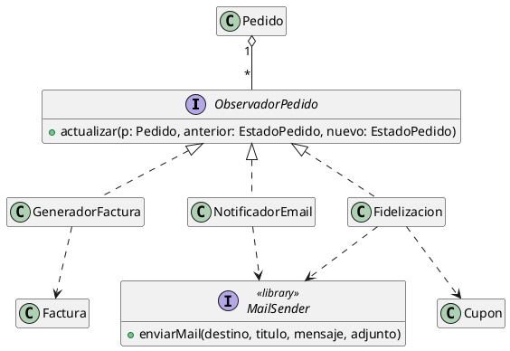
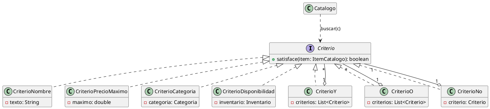
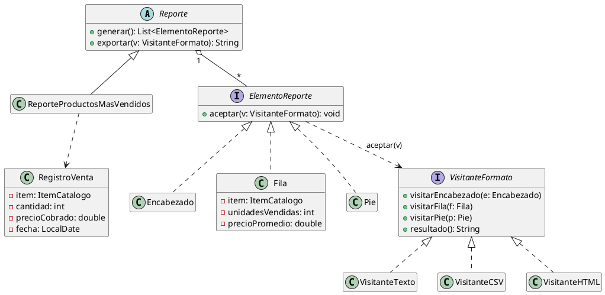

# Plan de UML — TP Integrador UNQ-Shop

Estrategia: **7 diagramas por módulo + 1 de integración**. Cada bloque trae el
PlantUML listo para renderizar. Las decisiones de diseño que el diagrama fija
están al final.

Convención de packages: `ar.edu.unq.po2.unqshop.<modulo>`.

---

## 0. Integración (cómo `Pedido` conecta todo)

`Pedido` es el centro del sistema:
- **Context** del State (`EstadoPedido`).
- **Subject** del Observer (`ObservadorPedido`).
- **Client** del Strategy de envío (`MetodoEnvio`).
- **Client** del Template Method de pago (`MetodoPago`).
- Contiene `LineaPedido` que referencian `ItemCatalogo` (Composite del catálogo).



---

## 1. Catálogo → Composite (+ Properties)

```plantuml
@startuml Catalogo
hide empty members
interface ItemCatalogo {
  +getNombre(): String
  +getDescripcion(): String
  +getPrecioBase(): double
  +perteneceA(c: Categoria): boolean
  +hayStockDisponible(inv: Inventario): boolean
  +validar(): void
}
class Producto {
  -sku: SKU
  -nombre: String
  -marca: Marca
  -categoria: Categoria
  -precio: double
  -precioFinal: double
  -atributos: Map<String,Object>
  +setAtributo(clave: String, valor: Object)
  +getAtributo(clave: String): Object
  +validar(): void
}
class Paquete {
  -nombre: String
  -descripcion: String
  -descuento: double
  +agregar(item: ItemCatalogo)
  +getPrecioBase(): double
}
class Catalogo {
  +agregar(item: ItemCatalogo)
  +buscar(criterio: Criterio): List<ItemCatalogo>
}
class SKU
enum Categoria { ELECTRONICA \n INDUMENTARIA \n HOGAR \n COCINA }
class Marca
class ValidacionInvalidaException

ItemCatalogo <|.. Producto
ItemCatalogo <|.. Paquete
Paquete "1" o-- "*" ItemCatalogo : items
Catalogo "1" o-- "*" ItemCatalogo
Producto --> SKU
Producto --> Categoria
Producto --> Marca
Producto ..> ValidacionInvalidaException
@enduml
```

- `Producto` = Leaf · `Paquete` = Composite · `ItemCatalogo` = Component.
- `Paquete.getPrecioBase()` = Σ hijos.getPrecioBase() × (1 − descuento).
- Atributos dinámicos = `Map<String,Object>` (patrón Properties).
- `validar()` chequea obligatorios (nombre, SKU) + claves dinámicas con valor.

---

## 2. Ciclo de vida del pedido → State



- Transiciones válidas viven en cada ConcreteState.
- `cancelar()` genera `NotaCredito`; reembolso asimétrico:
  EN_PREPARACION = producto + envío · ENVIADO = solo producto.

---

## 3. Métodos de envío → Strategy



- `CorreoArgentina` es librería externa provista (solo se usa, no se implementa).

---

## 4. Métodos de pago → Template Method



- `procesarPago()` = Template Method (orden fijo). `notificarResultado()` = hook.
- Las interfaces API se **definen, no se implementan** (requisito del enunciado).

---

## 5. Notificaciones del pedido → Observer



- `Pedido` (Subject) notifica `(estadoAnterior, estadoNuevo)` en `cambiarEstado()`.

---

## 6. Búsqueda → Composite + Specification



- Simples = Leaf · `CriterioY`/`CriterioO`/`CriterioNo` = Composite. Anidan sin límite.

---

## 7. Reportes → Visitor



- `VisitanteFormato` = Visitor · Texto/CSV/HTML = ConcreteVisitor ·
  Encabezado/Fila/Pie = Element (doble despacho con `aceptar`).

---

## Clases de apoyo (transversales)

- `Cliente` (nombre, email), `Direccion`, `Sucursal`, `Deposito`.
- `Inventario`: mapea `Producto × Deposito → cantidad`; `hayStock`, `decrementar`,
  `reponer`. Consultado por State (módulo 2) y CriterioDisponibilidad (módulo 6).
- `SKU`, `Marca`, `Categoria` (enum), `NotaCredito`, `Comprobante`, `Factura`,
  `Cupon`, `RegistroVenta`.

## Decisiones de diseño fijadas por el UML

1. Precio de paquete usa el **precio final** de cada ítem × (1 − descuento del paquete).
2. `ItemCatalogo` expone `perteneceA` y `hayStockDisponible` para que los criterios
   funcionen uniformemente sobre productos y paquetes (Composite).
3. El **stock** vive en `Inventario`, no en el Producto.
4. `Pedido` es Context + Subject + Client de envío y pago a la vez.
5. El pedido contiene `LineaPedido` (ítem + cantidad), no ítems sueltos.
6. `EstadoBase` (clase abstracta) lanza `OperacionInvalidaException` por defecto;
   cada estado concreto solo redefine sus operaciones válidas.
```
