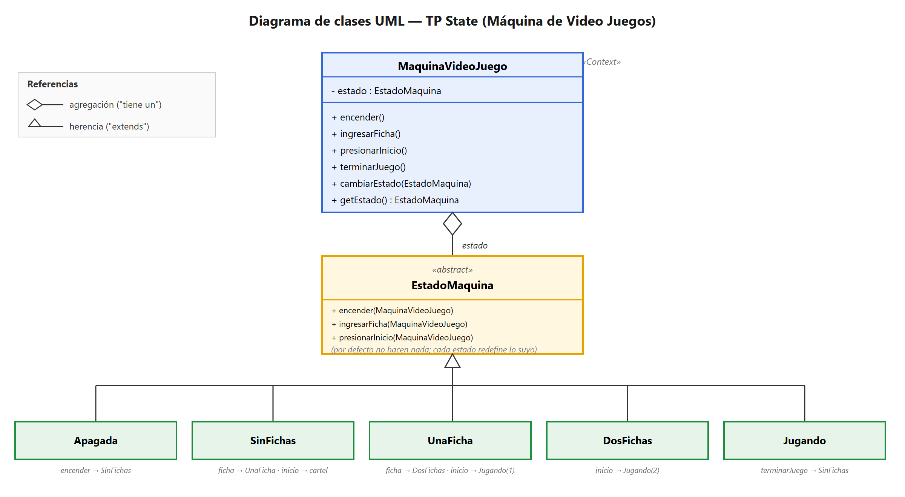
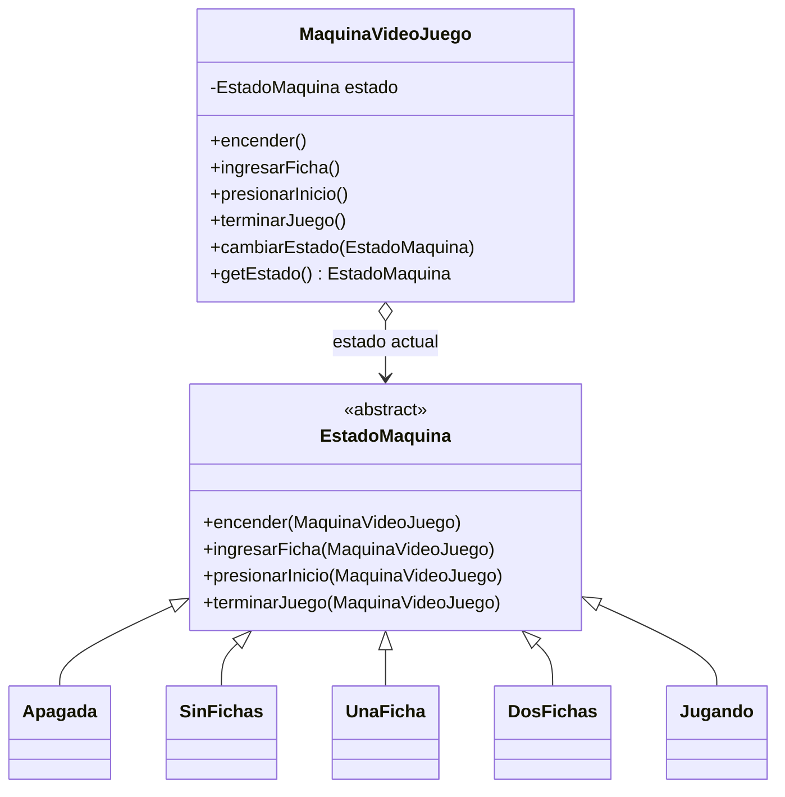

# TP State · Resolución

> Patrón **State**: el comportamiento de un objeto cambia según su **estado interno**, y los estados disparan las transiciones.

---

# Ejercicio 1 — Máquina de Video Juegos 🕹️

## Consigna (resumen)
Una máquina funciona ingresando **fichas**. Tiene un botón de inicio y una ranura para fichas:
- Al encenderla, **presionar inicio** muestra el cartel *"ingresen fichas"*.
- Con **1 ficha** + inicio → juego de **1 jugador**.
- Con **2 fichas** + inicio → juego de **2 jugadores**.
- Cuando termina el juego → vuelve al momento inicial.

Pide: (1) diagrama UML, (2) tests de cambios de estado, (3) implementación en Java.

## 1) Diagrama de clases UML



> Fuente editable: [UML_State_VideoJuego.svg](UML_State_VideoJuego.svg)



## 2) Tabla de transiciones (el "cerebro" del TP)

| Estado actual | `encender()` | `ingresarFicha()` | `presionarInicio()` | `terminarJuego()` |
|---|---|---|---|---|
| **Apagada** | → SinFichas | – | – | – |
| **SinFichas** | – | → UnaFicha | muestra *"ingresen fichas"* (no cambia) | – |
| **UnaFicha** | – | → DosFichas | → Jugando (1 jugador) | – |
| **DosFichas** | – | – (ya hay 2) | → Jugando (2 jugadores) | – |
| **Jugando** | – | – | – | → SinFichas |

> `–` = la acción no produce cambio de estado en ese estado.

## 3) Cómo se fue formando el diagrama (a partir del enunciado)

### Frase 1 — *"Una máquina de video juegos funciona ingresando fichas… posee un botón de inicio y una ranura para ingresar fichas."*
- Aparece la clase que el cliente usa: la máquina → **Context** `MaquinaVideoJuego`.
- Las cosas que se le hacen (encender, meter ficha, apretar inicio, fin del juego) son sus **operaciones públicas**.

### Frase 2 — *"…presionar el botón de inicio genera un cartel… si se introduce una ficha y se presiona inicio comienza el juego para un jugador; si antes se ingresaron dos fichas, juegan dos."*
- 🚩 **Frase clave:** la **misma acción** (`presionarInicio`) hace **cosas distintas** según cuántas fichas haya → el comportamiento depende del **estado interno** → patrón **State**.
- Cada "momento" de la máquina es un estado → **ConcreteState**: `Apagada`, `SinFichas`, `UnaFicha`, `DosFichas`, `Jugando`.
- Lo común a todos los estados (las 4 operaciones) se declara en una clase base → **State** `EstadoMaquina`.

### Frase 3 — *"Cuando termina el juego, vuelve al momento inicial."*
- Define la transición de `Jugando` con `terminarJuego()` → vuelve a `SinFichas` (el momento inicial, encendida y esperando fichas).

### Por qué clase abstracta y no interfaz
`EstadoMaquina` es una **clase abstracta** con las 4 operaciones implementadas "por defecto sin hacer nada". Así cada estado concreto **solo redefine las operaciones que le importan** (ej: `Apagada` solo redefine `encender`; `Jugando` solo `terminarJuego`). Con una interfaz, cada estado estaría obligado a escribir los 4 métodos aunque la mayoría no haga nada.

### Cómo se lee el diagrama
- `MaquinaVideoJuego o--> EstadoMaquina` → **agregación**: la máquina *tiene un* estado actual y le **delega** cada acción.
- `EstadoMaquina <|-- Apagada` → **herencia** (línea llena + triángulo): cada estado *extiende* la clase abstracta.

### Mapa rápido: enunciado → patrón
| En el enunciado | Rol en State | En el diagrama |
|---|---|---|
| La máquina | **Context** | `MaquinaVideoJuego` |
| Los "momentos" (apagada, esperando, jugando…) | **ConcreteState** | cajas verdes |
| Las acciones comunes (encender, ficha, inicio, fin) | **State** | `EstadoMaquina` (abstracta) |
| "la misma acción hace cosas distintas según el momento" | la idea de State | `presionarInicio` redefinido por estado |

---

## 4) Tests de unidad
> *(Pendiente — próximo paso)*

## 5) Implementación en Java

Archivos en `src/ar/edu/unq/po2/state/` (package `ar.edu.unq.po2.state`). **Compilado y probado con JDK 26.**

### `EstadoMaquina.java` (State — clase abstracta)
```java
package ar.edu.unq.po2.state;

public abstract class EstadoMaquina {

	public void encender(MaquinaVideoJuego maquina) { }
	public void ingresarFicha(MaquinaVideoJuego maquina) { }
	public void presionarInicio(MaquinaVideoJuego maquina) { }
	public void terminarJuego(MaquinaVideoJuego maquina) { }

	public abstract String nombre();
}
```
> Las 4 operaciones vienen "vacías" por defecto, así cada estado redefine solo las que usa.

### `MaquinaVideoJuego.java` (Context)
```java
package ar.edu.unq.po2.state;

public class MaquinaVideoJuego {

	private EstadoMaquina estado;

	public MaquinaVideoJuego() {
		this.estado = new Apagada();   // arranca apagada
	}

	public void cambiarEstado(EstadoMaquina nuevoEstado) {
		this.estado = nuevoEstado;
	}

	public EstadoMaquina getEstado() {
		return estado;
	}

	public void encender()        { estado.encender(this); }
	public void ingresarFicha()   { estado.ingresarFicha(this); }
	public void presionarInicio() { estado.presionarInicio(this); }
	public void terminarJuego()   { estado.terminarJuego(this); }
}
```

### `Apagada.java`
```java
package ar.edu.unq.po2.state;

public class Apagada extends EstadoMaquina {

	@Override
	public void encender(MaquinaVideoJuego maquina) {
		System.out.println("Máquina encendida.");
		maquina.cambiarEstado(new SinFichas());
	}

	@Override
	public String nombre() { return "Apagada"; }
}
```

### `SinFichas.java`
```java
package ar.edu.unq.po2.state;

public class SinFichas extends EstadoMaquina {

	@Override
	public void ingresarFicha(MaquinaVideoJuego maquina) {
		System.out.println("Ficha ingresada (1).");
		maquina.cambiarEstado(new UnaFicha());
	}

	@Override
	public void presionarInicio(MaquinaVideoJuego maquina) {
		System.out.println("Cartel: ingresen fichas.");
	}

	@Override
	public String nombre() { return "SinFichas"; }
}
```

### `UnaFicha.java`
```java
package ar.edu.unq.po2.state;

public class UnaFicha extends EstadoMaquina {

	@Override
	public void ingresarFicha(MaquinaVideoJuego maquina) {
		System.out.println("Ficha ingresada (2).");
		maquina.cambiarEstado(new DosFichas());
	}

	@Override
	public void presionarInicio(MaquinaVideoJuego maquina) {
		System.out.println("Comienza el juego para 1 jugador.");
		maquina.cambiarEstado(new Jugando());
	}

	@Override
	public String nombre() { return "UnaFicha"; }
}
```

### `DosFichas.java`
```java
package ar.edu.unq.po2.state;

public class DosFichas extends EstadoMaquina {

	@Override
	public void presionarInicio(MaquinaVideoJuego maquina) {
		System.out.println("Comienza el juego para 2 jugadores.");
		maquina.cambiarEstado(new Jugando());
	}

	@Override
	public String nombre() { return "DosFichas"; }
}
```
> `ingresarFicha` no se redefine: ya hay 2 fichas, usa el comportamiento por defecto (no hace nada).

### `Jugando.java`
```java
package ar.edu.unq.po2.state;

public class Jugando extends EstadoMaquina {

	@Override
	public void terminarJuego(MaquinaVideoJuego maquina) {
		System.out.println("Juego terminado. Vuelve al inicio.");
		maquina.cambiarEstado(new SinFichas());
	}

	@Override
	public String nombre() { return "Jugando"; }
}
```

### Salida del `Main` (verificada)
```
>> Estado actual: Apagada
--- Camino de 1 jugador ---
Máquina encendida.
>> Estado actual: SinFichas
Cartel: ingresen fichas.
Ficha ingresada (1).
>> Estado actual: UnaFicha
Comienza el juego para 1 jugador.
>> Estado actual: Jugando
Juego terminado. Vuelve al inicio.
>> Estado actual: SinFichas
--- Camino de 2 jugadores ---
Ficha ingresada (1).
Ficha ingresada (2).
>> Estado actual: DosFichas
Comienza el juego para 2 jugadores.
>> Estado actual: Jugando
Juego terminado. Vuelve al inicio.
>> Estado actual: SinFichas
```

### Idea clave del patrón State (para defender en el parcial)
- La máquina (Context) **no tiene `if (estado == ...)`**: delega cada acción en el objeto-estado actual.
- **Cada estado decide la transición** llamando a `maquina.cambiarEstado(new OtroEstado())`. Por eso los métodos reciben la máquina como parámetro.
- Diferencia con Strategy: en Strategy el cliente elige el algoritmo desde afuera; en State, **los estados se cambian a sí mismos** según la lógica interna.
