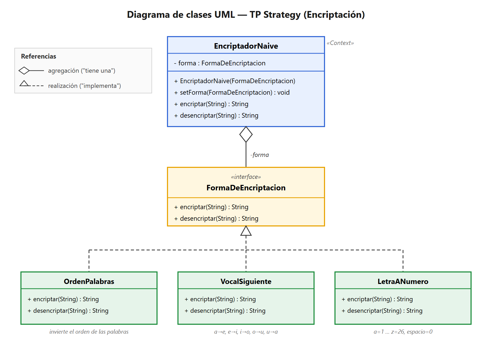
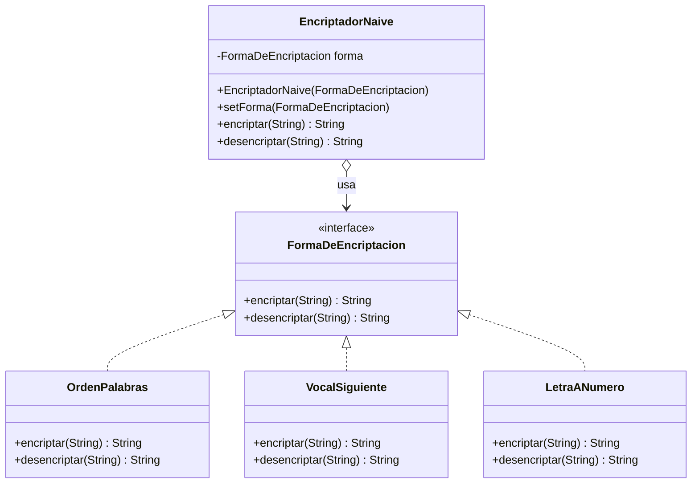

# TP Strategy — Encriptación · Resolución

## Consigna (resumen)

Implementar la clase **`EncriptadorNaive`**, que transforma cadenas de texto para enviarlas seguras por la red. Tiene **una forma de encriptar por defecto** (cambiar el orden de las palabras) y debe poder **agregar nuevas formas** de encriptar/desencriptar. Ejemplos:

1. **Vocal siguiente:** cada vocal → la vocal siguiente (a→e, e→i, i→o, o→u, u→a). Consonantes, números y otros caracteres no cambian.
2. **Letra a número:** cada letra → su número de orden (a=1, b=2, …); el espacio es `0`; separados por comas. Ej: `"Diego"` → `"4,9,5,7,15"`. No distingue mayúsculas/minúsculas; sin acentos.

Métodos públicos: `String encriptar(String texto)` y `String desencriptar(String texto)` (desencriptar = la inversa).

**Se pide:** (1) diagrama UML, (2) tests de unidad, (3) implementación en Java.

---

## 1) Diagrama de clases UML



> Fuente editable: [UML_Strategy.svg](UML_Strategy.svg)

### Versión Mermaid (editable en texto)



---

## 2) Cómo se fue formando el diagrama (a partir del enunciado)

La idea es leer el enunciado y traducir cada frase a un elemento del diagrama. Frase por frase:

### Frase 1 — *"Debe implementar la clase `EncriptadorNaive`, que se encarga de transformar cadenas de texto…"*
- Aparece una clase con nombre y una **responsabilidad** (transformar texto).
- Como es la clase que **el cliente usa** y que ofrece los métodos `encriptar` / `desencriptar`, será el **Context** del patrón.
- 🧩 **Al diagrama:** caja `EncriptadorNaive` con los métodos `+ encriptar(String) : String` y `+ desencriptar(String) : String`.

### Frase 2 — *"…posee una única forma de encriptar… Luego, debe **agregar nuevas formas** de encriptar y desencriptar…"*
- 🚩 **Esta es la frase clave.** "Varias formas de hacer lo mismo (encriptar) que se pueden intercambiar y ampliar" = **familia de algoritmos intercambiables** → patrón **Strategy**.
- Si dejáramos cada forma como un `if/else` dentro de `EncriptadorNaive`, agregar una forma nueva nos obligaría a tocar esa clase cada vez. Para evitarlo, **extraemos la "forma de encriptar" a una interfaz**.
- 🧩 **Al diagrama:** interfaz `FormaDeEncriptacion` (la *Strategy*). El `EncriptadorNaive` **no hereda** de ella: la **tiene como atributo** (`- forma`). Por eso la relación es de **agregación** (`o-->`, "tiene una"), no de herencia.

### Frase 3 — *"…el método desencriptar realiza la **inversa** de cada uno."*
- Cada forma debe saber **encriptar y también desencriptar** (su inversa).
- 🧩 **Al diagrama:** la interfaz `FormaDeEncriptacion` declara **dos** métodos: `encriptar(String)` y `desencriptar(String)`. Así cada estrategia es autocontenida (sabe ida y vuelta).

### Frase 4 — *"…por ejemplo: 1) vocal siguiente, 2) letra a número"* (+ la forma por defecto: orden de palabras)
- Cada "ejemplo" es **una forma concreta** de encriptar.
- 🧩 **Al diagrama:** una clase por forma, todas implementando la interfaz (*ConcreteStrategy*):
  - `OrdenPalabras` → invierte el orden de las palabras (la forma por defecto).
  - `VocalSiguiente` → corrimiento de vocales.
  - `LetraANumero` → letra ↔ número.
- La relación con la interfaz es **realización** (`<|..`, línea punteada + triángulo): cada una *implementa* el contrato.

### Resultado y por qué conviene
- Para **agregar una forma nueva** (ej. "código Morse"), solo creás una clase que implemente `FormaDeEncriptacion`. **No tocás `EncriptadorNaive` ni las otras formas** → cumple el principio **Abierto/Cerrado** (abierto a extensión, cerrado a modificación).
- Para **cambiar la forma en tiempo de ejecución**: `encriptador.setForma(new LetraANumero())`.
- El `EncriptadorNaive` **delega**: cuando le pedís `encriptar(texto)`, internamente hace `forma.encriptar(texto)` y deja que la estrategia concreta decida *cómo*.

### Mapa rápido: enunciado → patrón
| En el enunciado | Rol en Strategy | En el diagrama |
|---|---|---|
| `EncriptadorNaive` (la clase que usa el cliente) | **Context** | Caja azul, tiene `- forma` |
| "formas de encriptar" intercambiables y ampliables | **Strategy** (interfaz) | `FormaDeEncriptacion` |
| Orden de palabras / vocal siguiente / letra a número | **ConcreteStrategy** | Cajas verdes |
| "desencriptar = la inversa" | métodos del contrato | `encriptar` + `desencriptar` en la interfaz |

---

## 3) Tests de unidad

Tests con **JUnit 5 (Jupiter)** en `test/ar/edu/unq/po2/strategy/`. **Ejecutados: 17/17 en verde.** ✅

### Estructura de un test (patrón AAA)
- **`@Test`** marca un método como caso de prueba.
- **`@BeforeEach`** se ejecuta antes de cada test (para tener un objeto "limpio").
- **`assertEquals(esperado, real)`** verifica que el resultado sea el esperado.

### `LetraANumeroTest.java`
```java
package ar.edu.unq.po2.teststrategy;

import ar.edu.unq.po2.strategy.*;

import static org.junit.jupiter.api.Assertions.assertEquals;
import org.junit.jupiter.api.BeforeEach;
import org.junit.jupiter.api.Test;

class LetraANumeroTest {

	private LetraANumero forma;

	@BeforeEach
	void setUp() {
		forma = new LetraANumero();
	}

	@Test
	void encriptarUnaPalabra() {
		assertEquals("4,9,5,7,15", forma.encriptar("diego"));
	}

	@Test
	void encriptarNoDistingueMayusculas() {
		assertEquals("4,9,5,7,15", forma.encriptar("Diego"));
	}

	@Test
	void encriptarUsaElCeroParaElEspacio() {
		assertEquals("1,0,2", forma.encriptar("a b"));
	}

	@Test
	void desencriptarUnaPalabra() {
		assertEquals("diego", forma.desencriptar("4,9,5,7,15"));
	}

	@Test
	void desencriptarInterpretaElCeroComoEspacio() {
		assertEquals("a b", forma.desencriptar("1,0,2"));
	}

	@Test
	void encriptarYLuegoDesencriptarDevuelveElOriginal() {
		assertEquals("hola mundo", forma.desencriptar(forma.encriptar("hola mundo")));
	}
}
```

### `OrdenPalabrasTest.java`
```java
package ar.edu.unq.po2.teststrategy;

import ar.edu.unq.po2.strategy.*;

import static org.junit.jupiter.api.Assertions.assertEquals;
import org.junit.jupiter.api.BeforeEach;
import org.junit.jupiter.api.Test;

class OrdenPalabrasTest {

	private OrdenPalabras forma;

	@BeforeEach
	void setUp() {
		forma = new OrdenPalabras();
	}

	@Test
	void encriptarInvierteElOrdenDeLasPalabras() {
		assertEquals("cruel mundo hola", forma.encriptar("hola mundo cruel"));
	}

	@Test
	void unaSolaPalabraQuedaIgual() {
		assertEquals("hola", forma.encriptar("hola"));
	}

	@Test
	void desencriptarVuelveAlOrdenOriginal() {
		assertEquals("hola mundo cruel", forma.desencriptar("cruel mundo hola"));
	}

	@Test
	void encriptarYLuegoDesencriptarDevuelveElOriginal() {
		assertEquals("uno dos tres", forma.desencriptar(forma.encriptar("uno dos tres")));
	}
}
```

### `VocalSiguienteTest.java`
```java
package ar.edu.unq.po2.teststrategy;

import ar.edu.unq.po2.strategy.*;

import static org.junit.jupiter.api.Assertions.assertEquals;
import org.junit.jupiter.api.BeforeEach;
import org.junit.jupiter.api.Test;

class VocalSiguienteTest {

	private VocalSiguiente forma;

	@BeforeEach
	void setUp() {
		forma = new VocalSiguiente();
	}

	@Test
	void encriptarCorreCadaVocalALaSiguiente() {
		assertEquals("eioua", forma.encriptar("aeiou"));
	}

	@Test
	void encriptarDejaIgualLasConsonantes() {
		assertEquals("cese", forma.encriptar("casa"));
	}

	@Test
	void desencriptarHaceElCorrimientoInverso() {
		assertEquals("aeiou", forma.desencriptar("eioua"));
	}

	@Test
	void encriptarYLuegoDesencriptarDevuelveElOriginal() {
		assertEquals("murcielago", forma.desencriptar(forma.encriptar("murcielago")));
	}
}
```

### `EncriptadorNaiveTest.java` (prueba el Context: delegación + cambio de estrategia)
```java
package ar.edu.unq.po2.teststrategy;

import ar.edu.unq.po2.strategy.*;

import static org.junit.jupiter.api.Assertions.assertEquals;
import org.junit.jupiter.api.Test;

class EncriptadorNaiveTest {

	@Test
	void usaLaFormaConLaQueSeCreo() {
		EncriptadorNaive enc = new EncriptadorNaive(new LetraANumero());
		assertEquals("4,9,5,7,15", enc.encriptar("diego"));
	}

	@Test
	void desencriptarTambienDelegaEnLaForma() {
		EncriptadorNaive enc = new EncriptadorNaive(new LetraANumero());
		assertEquals("diego", enc.desencriptar("4,9,5,7,15"));
	}

	@Test
	void setFormaCambiaElComportamientoEnTiempoDeEjecucion() {
		EncriptadorNaive enc = new EncriptadorNaive(new OrdenPalabras());
		assertEquals("mundo hola", enc.encriptar("hola mundo"));

		enc.setForma(new LetraANumero());
		assertEquals("4,9,5,7,15", enc.encriptar("diego"));
	}
}
```

### Cómo correr los tests en Eclipse
1. **Agregar JUnit 5 al proyecto** (una sola vez): clic derecho en el proyecto → **Build Path → Add Libraries… → JUnit → Next → JUnit 5 → Finish**.
2. Los tests están en el package `ar.edu.unq.po2.teststrategy` (carpeta fuente `Test`). Como están en un package distinto al de las clases, llevan `import ar.edu.unq.po2.strategy.*;` para "ver" a `LetraANumero`, `EncriptadorNaive`, etc.
   - *(Alternativa: ponerlos en el mismo package `ar.edu.unq.po2.strategy` y entonces el import no hace falta.)*
3. Cada método de prueba lleva `@Test` y el `setUp()` lleva `@BeforeEach` (sin esas anotaciones, JUnit no los reconoce como tests).
4. Clic derecho sobre un test (o sobre el package) → **Run As → JUnit Test**.
5. Se abre la vista **JUnit** con la barra: **verde = todo OK**, roja = algún fallo (te dice cuál y por qué).

## 4) Implementación en Java

Archivos en `src/ar/edu/unq/po2/strategy/` (package `ar.edu.unq.po2.strategy`). **Compilado y probado con JDK 26** — la salida coincide con el ejemplo de la consigna.

### `FormaDeEncriptacion.java` (Strategy — interfaz)
```java
package ar.edu.unq.po2.strategy;

public interface FormaDeEncriptacion {
	String encriptar(String texto);
	String desencriptar(String texto);
}
```

### `EncriptadorNaive.java` (Context)
```java
package ar.edu.unq.po2.strategy;

public class EncriptadorNaive {

	private FormaDeEncriptacion forma;

	public EncriptadorNaive(FormaDeEncriptacion forma) {
		this.forma = forma;
	}

	public void setForma(FormaDeEncriptacion forma) {
		this.forma = forma;
	}

	public String encriptar(String texto) {
		return forma.encriptar(texto);   // delega en la estrategia
	}

	public String desencriptar(String texto) {
		return forma.desencriptar(texto);
	}
}
```

### `OrdenPalabras.java` (ConcreteStrategy — forma por defecto)
```java
package ar.edu.unq.po2.strategy;

public class OrdenPalabras implements FormaDeEncriptacion {

	@Override
	public String encriptar(String texto) {
		String[] palabras = texto.split(" ");
		StringBuilder sb = new StringBuilder();
		for (int i = palabras.length - 1; i >= 0; i--) {
			sb.append(palabras[i]);
			if (i > 0) {
				sb.append(" ");
			}
		}
		return sb.toString();
	}

	@Override
	public String desencriptar(String texto) {
		return encriptar(texto);   // invertir dos veces restaura el original
	}
}
```

### `VocalSiguiente.java` (ConcreteStrategy)
```java
package ar.edu.unq.po2.strategy;

public class VocalSiguiente implements FormaDeEncriptacion {

	private static final String VOCALES = "aeiou";
	private static final String SIGUIENTE = "eioua";

	@Override
	public String encriptar(String texto) {
		return correr(texto, VOCALES, SIGUIENTE);
	}

	@Override
	public String desencriptar(String texto) {
		return correr(texto, SIGUIENTE, VOCALES);
	}

	private String correr(String texto, String desde, String hasta) {
		StringBuilder sb = new StringBuilder();
		for (char c : texto.toCharArray()) {
			int i = desde.indexOf(Character.toLowerCase(c));
			if (i >= 0) {
				char nueva = hasta.charAt(i);
				if (Character.isUpperCase(c)) {
					sb.append(Character.toUpperCase(nueva));
				} else {
					sb.append(nueva);
				}
			} else {
				sb.append(c);
			}
		}
		return sb.toString();
	}
}
```

### `LetraANumero.java` (ConcreteStrategy)
```java
package ar.edu.unq.po2.strategy;

public class LetraANumero implements FormaDeEncriptacion {

	@Override
	public String encriptar(String texto) {
		StringBuilder sb = new StringBuilder();
		for (char c : texto.toLowerCase().toCharArray()) {
			int numero;
			if (c == ' ') {
				numero = 0;
			} else {
				numero = c - 'a' + 1;
			}

			if (sb.length() > 0) {
				sb.append(",");
			}
			sb.append(numero);
		}
		return sb.toString();
	}

	@Override
	public String desencriptar(String texto) {
		if (texto.isEmpty()) {
			return "";
		}
		StringBuilder sb = new StringBuilder();
		for (String parte : texto.split(",")) {
			int numero = Integer.parseInt(parte.trim());
			if (numero == 0) {
				sb.append(' ');
			} else {
				sb.append((char) ('a' + numero - 1));
			}
		}
		return sb.toString();
	}
}
```

### `Main.java` (demo) — salida verificada
```
OrdenPalabras   -> cruel mundo hola
  desencriptado -> hola mundo cruel
VocalSiguiente  -> marcoilegu
  desencriptado -> murcielago
LetraANumero    -> 4,9,5,7,15
  desencriptado -> diego
```

### Cómo importarlo en Eclipse
1. En tu proyecto, hacé clic derecho en `src` → **New > Package** → nombre `ar.edu.unq.po2.strategy` (o el que uses; si lo cambiás, actualizá la línea `package ...;` en cada archivo).
2. Copiá los 6 `.java` dentro de ese package (o arrastrá la carpeta `src/ar` al `src` del proyecto).
3. Abrí `Main.java` → **Run As > Java Application** (▶).

### Decisiones de diseño (para defender en el parcial)
- **`OrdenPalabras` es una estrategia más** (no quedó hardcodeada en `EncriptadorNaive`). Así la forma por defecto se trata igual que las demás y el Context queda 100% desacoplado.
- **`desencriptar` es siempre la inversa exacta** de `encriptar` en cada estrategia (en `OrdenPalabras` coinciden porque invertir es su propia inversa).
- **`LetraANumero` no distingue mayúsculas** (lo pide la consigna): al desencriptar devuelve minúsculas. Por eso `"Diego"` → `"4,9,5,7,15"` → `"diego"`.
- Para **agregar una forma nueva** (ej. Morse): creás una clase que implemente `FormaDeEncriptacion`. No se toca ninguna clase existente (**Abierto/Cerrado**).
